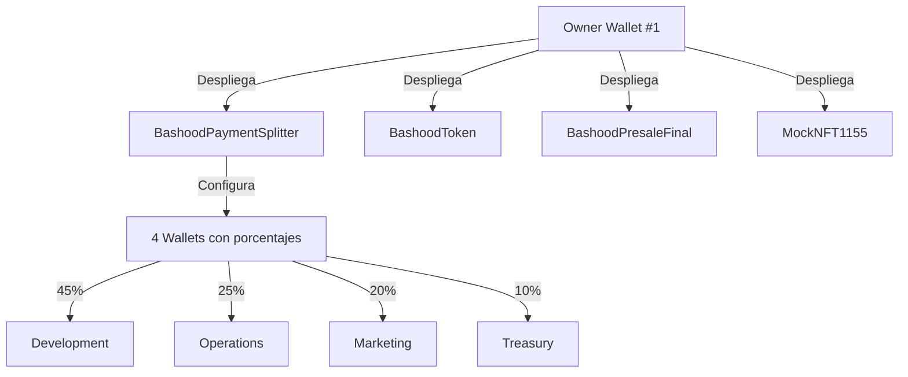
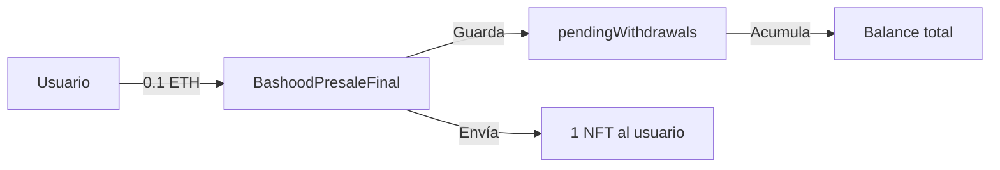
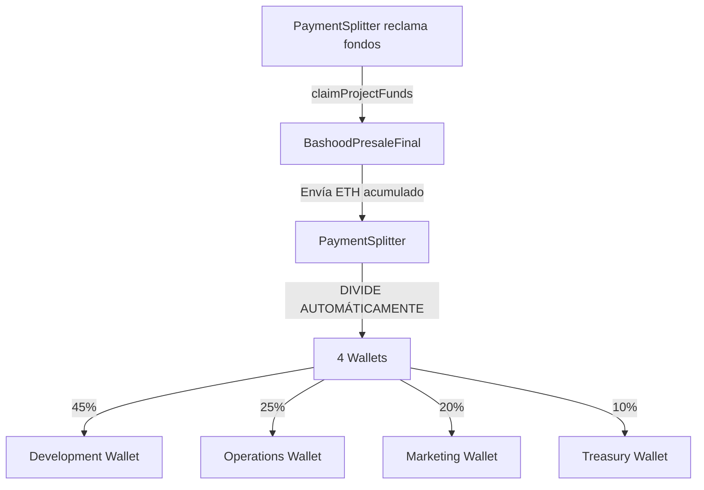

# 💰 FLUJO DE REPARTO DE BENEFICIOS - BASHOOD

## 🎯 RESUMEN EJECUTIVO

**Solo necesitas 1 clave privada para operar todo el sistema.**
Las otras 3 wallets solo necesitan **direcciones públicas** para recibir fondos.

---

## 🔑 CONFIGURACIÓN DE WALLETS

### Wallet #1: DEPLOYER/OWNER (Development - 45%)
```
Clave Privada: [REDACTED — usar .env local, nunca commitear]
Dirección: 0xf39Fd6e51aad88F6F4ce6aB8827279cffFb92266
Uso: Desplegar contratos, administrar sistema, recibir 45% de beneficios
Rol: ADMIN_ROLE, deployer
```

**⚠️ NOTA:** Esta es la clave privada por defecto de Hardhat (Account #0).
Es de dominio público. SOLO usar en testnet.

### Wallet #2: OPERATIONS (25%)
```
Dirección Pública: 0x70997970C51812dc3A010C7d01b50e0d17dc79C8
Uso: Recibir 25% de beneficios automáticamente
Rol: Ninguno (solo recibe fondos)
```

### Wallet #3: MARKETING (20%)
```
Dirección Pública: 0x3C44CdDdB6a900fa2b585dd299e03d12FA4293BC
Uso: Recibir 20% de beneficios automáticamente
Rol: Ninguno (solo recibe fondos)
```

### Wallet #4: TREASURY (10%)
```
Dirección Pública: [A calcular desde clave provista]
Uso: Recibir 10% de beneficios automáticamente
Rol: Ninguno (solo recibe fondos)
```

---

## 🔄 FLUJO COMPLETO - PASO A PASO

### FASE 1: DESPLIEGUE (Solo 1 vez)



**Script de despliegue:**
```bash
npx hardhat run scripts/deploy-bashood-complete.js --network base-sepolia
```

**Lo que sucede:**
1. Wallet #1 despliega todos los contratos
2. PaymentSplitter se configura con las 4 direcciones:
   - Development: 0xf39Fd6e51aad88F6F4ce6aB8827279cffFb92266 (45%)
   - Operations: 0x70997970C51812dc3A010C7d01b50e0d17dc79C8 (25%)
   - Marketing: 0x3C44CdDdB6a900fa2b585dd299e03d12FA4293BC (20%)
   - Treasury: [dirección wallet #4] (10%)
3. BashoodPresaleFinal se configura con:
   - `projectWallet` = PaymentSplitter address
   - Precio NFT: 0.1 ETH
   - Precio BHT: 25,000 tokens

---

### FASE 2: PREVENTA (Usuarios compran)



**Ejemplo:** Usuario compra 1 NFT por 0.1 ETH

1. Usuario llama: `purchaseWithETH(nftId, 1, nonce, signature)` con 0.1 ETH
2. BashoodPresaleFinal:
   - Recibe 0.1 ETH
   - Guarda en `pendingWithdrawals[PaymentSplitter]` = 0.1 ETH
   - Transfiere 1 NFT al usuario
3. Los fondos quedan **pendientes** (pull-payment pattern)

---

### FASE 3: RECLAMACIÓN DE FONDOS



**¿Quién puede reclamar?**
```javascript
// OPCIÓN A: PaymentSplitter reclama de BashoodPresaleFinal
await bashoodPresaleFinal.claimProjectFunds();
// Ahora PaymentSplitter tiene los fondos

// OPCIÓN B: Cada wallet reclama su parte
await paymentSplitter.release(developmentWallet); // 45%
await paymentSplitter.release(operationsWallet);  // 25%
await paymentSplitter.release(marketingWallet);   // 20%
await paymentSplitter.release(treasuryWallet);    // 10%

// OPCIÓN C: Owner distribuye todo de golpe
await paymentSplitter.releaseAll();
// Todas las wallets reciben sus fondos automáticamente
```

---

### FASE 4: USO DE FONDOS (Cada equipo)

```
Development Wallet (45%):
├─ Auditorías de seguridad
├─ Desarrollo de nuevas funcionalidades
├─ Costos legales y compliance
└─ Infraestructura técnica

Operations Wallet (25%):
├─ Salarios del equipo
├─ Gas fees para operaciones
├─ Servidores y hosting
└─ Herramientas y software

Marketing Wallet (20%):
├─ Campañas publicitarias
├─ Community managers
├─ Influencers y partnerships
└─ Diseño gráfico y contenido

Treasury Wallet (10%):
├─ Reserva de emergencia
├─ Liquidez para DEX (Uniswap/SushiSwap)
├─ Oportunidades estratégicas
└─ Buffer para volatilidad
```

---

## 💡 CÓDIGO - Cómo funciona por dentro

### BashoodPaymentSplitter.sol

```solidity
// Constructor define las 4 wallets y porcentajes
constructor(
    address payable developmentWallet,  // 45%
    address payable operationsWallet,   // 25%
    address payable marketingWallet,    // 20%
    address payable treasuryWallet      // 10%
) 
    PaymentSplitter(
        [dev, ops, mkt, trs],  // Array de wallets
        [45, 25, 20, 10]       // Array de shares
    ) 
{
    // Validaciones...
}

// Recibe ETH automáticamente
receive() external payable {
    emit FundsReceived(msg.sender, msg.value);
}

// Distribuir a todas las wallets
function releaseAll() external {
    release(payable(payee(0))); // Development (45%)
    release(payable(payee(1))); // Operations (25%)
    release(payable(payee(2))); // Marketing (20%)
    release(payable(payee(3))); // Treasury (10%)
}
```

### BashoodPresaleFinal.sol

```solidity
// Cuando usuario compra NFT
function purchaseWithETH(...) external payable {
    require(msg.value == nftPriceETH * quantity); // 0.1 ETH × cantidad
    
    // Programa el pago (pull-payment)
    pendingWithdrawals[projectWallet] += msg.value;
    emit PaymentScheduled(projectWallet, msg.value);
    
    // Envía NFT al usuario
    nftContract.safeTransferFrom(address(this), msg.sender, nftId, quantity, "");
}

// PaymentSplitter reclama los fondos acumulados
function claimProjectFunds() external nonReentrant {
    uint256 amount = pendingWithdrawals[msg.sender];
    require(amount > 0, "No funds to claim");
    
    pendingWithdrawals[msg.sender] = 0; // Reset
    
    // Envía ETH al PaymentSplitter
    (bool ok, ) = payable(msg.sender).call{value: amount}("");
    require(ok, "Claim transfer failed");
    
    emit PaymentClaimed(msg.sender, amount);
}
```

---

## 📊 EJEMPLO NUMÉRICO

**Escenario:** Se venden 1,000 NFTs en la preventa

```
INGRESOS TOTALES:
1,000 NFTs × 0.1 ETH = 100 ETH

DISTRIBUCIÓN AUTOMÁTICA:
├─ Development: 100 × 45% = 45 ETH ($103,500 USD @ $2,300/ETH)
├─ Operations:  100 × 25% = 25 ETH ($57,500 USD)
├─ Marketing:   100 × 20% = 20 ETH ($46,000 USD)
└─ Treasury:    100 × 10% = 10 ETH ($23,000 USD)

TOTAL: 100 ETH ($230,000 USD)
```

**Cómo fluye el dinero:**

```
DÍA 1-30: PREVENTA ACTIVA
- Usuarios compran NFTs
- ETH se acumula en BashoodPresaleFinal
- pendingWithdrawals[PaymentSplitter] = 100 ETH

DÍA 31: CIERRE DE PREVENTA
- Owner llama: bashoodPresaleFinal.claimProjectFunds()
- 100 ETH se transfieren a PaymentSplitter
- PaymentSplitter divide automáticamente:
  - Development: 45 ETH esperando
  - Operations: 25 ETH esperando
  - Marketing: 20 ETH esperando
  - Treasury: 10 ETH esperando

DÍA 32: DISTRIBUCIÓN
- Owner llama: paymentSplitter.releaseAll()
- Development recibe 45 ETH en su wallet
- Operations recibe 25 ETH en su wallet
- Marketing recibe 20 ETH en su wallet
- Treasury recibe 10 ETH en su wallet

DÍA 33+: USO DE FONDOS
- Cada equipo usa sus fondos independientemente
- No necesitan permiso del owner
- Solo necesitan clave privada para gastar
```

---

## 🔧 COMANDOS ÚTILES

### Ver información del PaymentSplitter
```javascript
const info = await paymentSplitter.getDistributionInfo();
console.log("Wallets:", info.wallets);
console.log("Shares:", info.shares); // [45, 25, 20, 10]
console.log("Pending:", info.pending); // Pendiente de reclamar
console.log("Released:", info.released); // Ya distribuido
```

### Verificar balance de una wallet
```javascript
const pending = await paymentSplitter.releasable(operationsWallet);
console.log(`Operations tiene ${ethers.formatEther(pending)} ETH pendientes`);
```

### Reclamar fondos (desde cada wallet)
```javascript
// Desde Development Wallet
await paymentSplitter.connect(developmentSigner).release(developmentWallet);

// Desde Operations Wallet
await paymentSplitter.connect(operationsSigner).release(operationsWallet);

// O desde Owner (distribuir todo)
await paymentSplitter.connect(ownerSigner).releaseAll();
```

---

## ❓ PREGUNTAS FRECUENTES

### 1. ¿Necesito las 4 claves privadas para desplegar?
**No.** Solo necesitas la clave privada de la Wallet #1 (owner) para desplegar.

### 2. ¿Cómo reciben fondos las Wallets #2, #3, #4?
**Automáticamente.** El contrato PaymentSplitter les envía ETH directamente a sus direcciones.

### 3. ¿Qué pasa si pierdo la clave privada de Operations Wallet?
**Los fondos están perdidos** para esa wallet. Por eso en producción se recomienda Gnosis Safe multi-sig.

### 4. ¿Puedo cambiar los porcentajes después?
**No.** Los porcentajes (45/25/20/10) están hardcodeados en el contrato. Para cambiarlos necesitas desplegar un nuevo PaymentSplitter.

### 5. ¿Puedo cambiar las wallets después?
**No.** Las wallets están fijas en el constructor. Para cambiarlas necesitas desplegar un nuevo PaymentSplitter.

### 6. ¿Qué pasa si envío ETH directamente al PaymentSplitter?
Se acepta y se distribuye según los porcentajes (45/25/20/10) entre las 4 wallets.

### 7. ¿Necesito llamar claimProjectFunds() después de cada venta?
**No.** Puedes acumular ventas y reclamar una vez al final de la preventa, o periódicamente (diario, semanal, etc.).

### 8. ¿Quién paga el gas para distribuir?
El que llama la función `releaseAll()` o `release()`. Normalmente el owner o cada wallet individualmente.

---

## 🛡️ SEGURIDAD - BUENAS PRÁCTICAS

### Para TESTNET (Base Sepolia):
✅ Usa las claves de Hardhat (son públicas, no importa)
✅ Puedes compartir direcciones públicas
✅ No hay riesgo financiero (ETH de prueba sin valor)

### Para MAINNET (Base producción):
❌ NUNCA compartas claves privadas (ni con AI, ni con nadie)
✅ Usa Gnosis Safe multi-sig para las 4 wallets
✅ Requiere 2-de-3 o 3-de-5 firmas para mover fondos
✅ Hardware wallets (Ledger/Trezor) para signers
✅ Testea PRIMERO en testnet
✅ Auditoría profesional antes de mainnet

---

## 📈 PRÓXIMOS PASOS

1. ✅ **Configurar .env** con 1 clave privada (owner)
2. ✅ **Calcular dirección** de la 4ª wallet desde su clave
3. ✅ **Actualizar deploy scripts** con las 4 direcciones públicas
4. 🔄 **Desplegar en Base Sepolia** (testnet)
5. 🧪 **Probar flujo completo**:
   - Comprar NFT con ETH
   - Verificar pendingWithdrawals
   - Reclamar fondos
   - Verificar distribución 45/25/20/10
6. 📊 **Monitorear eventos** (FundsReceived, PaymentScheduled, PaymentClaimed)
7. 🚀 **Si todo funciona → Preparar mainnet** con multi-sig

---

## 🎯 CONCLUSIÓN

**EL SISTEMA ES AUTOMÁTICO:**
- NO necesitas mover fondos manualmente
- NO necesitas 4 claves privadas para operar
- NO es la Wallet #1 quien reparte (es el contrato PaymentSplitter)
- SÍ solo necesitas 1 clave privada (owner) para desplegar y administrar
- SÍ las otras 3 wallets solo necesitan direcciones públicas para recibir

**FLUJO SIMPLIFICADO:**
```
Usuario paga → BashoodPresaleFinal acumula → PaymentSplitter reclama → Divide automáticamente → 4 wallets reciben
```

**SEGURIDAD:**
- Testnet = Sin riesgo (ETH de prueba)
- Mainnet = Usar Gnosis Safe multi-sig
