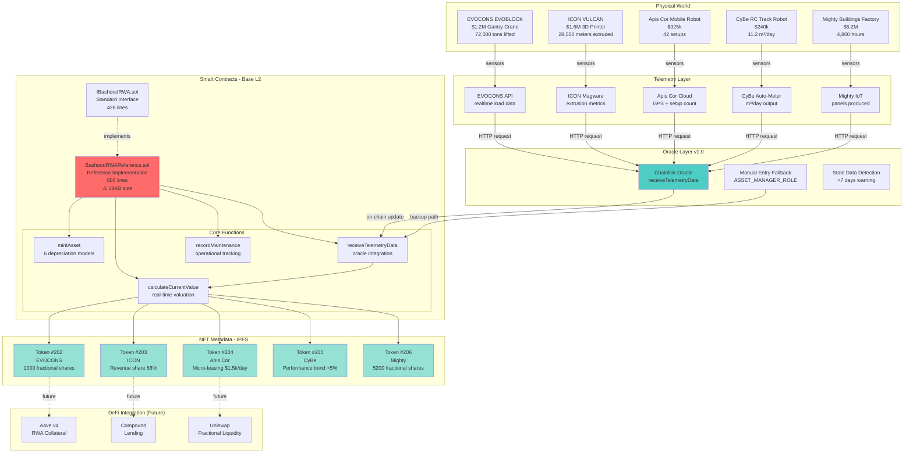
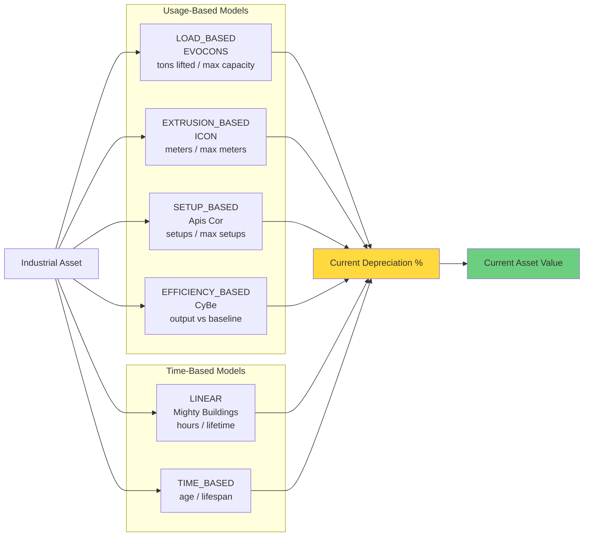
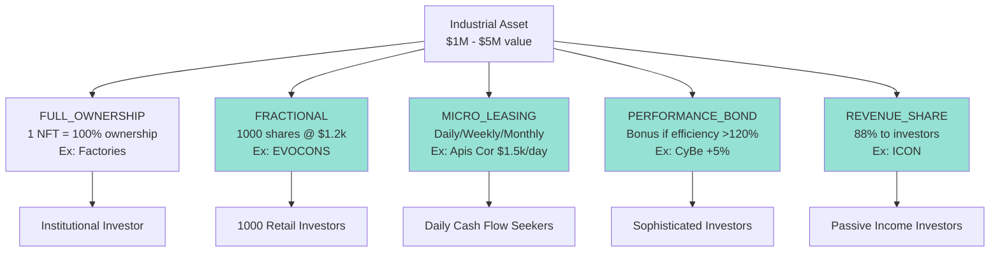
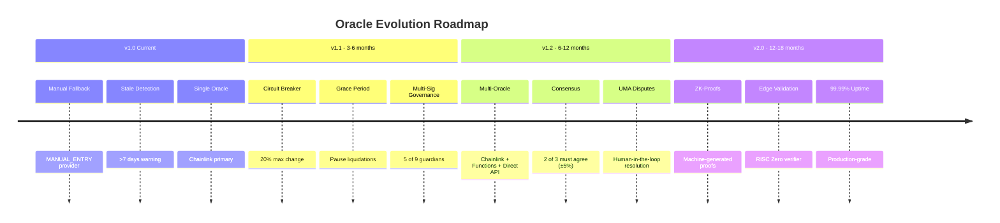
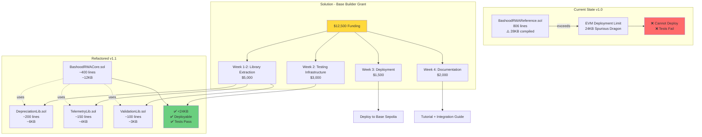
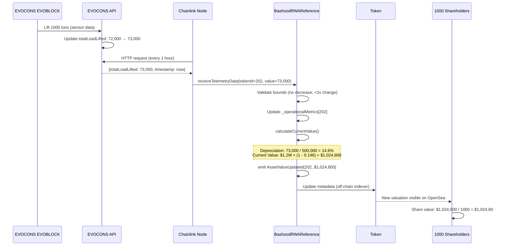
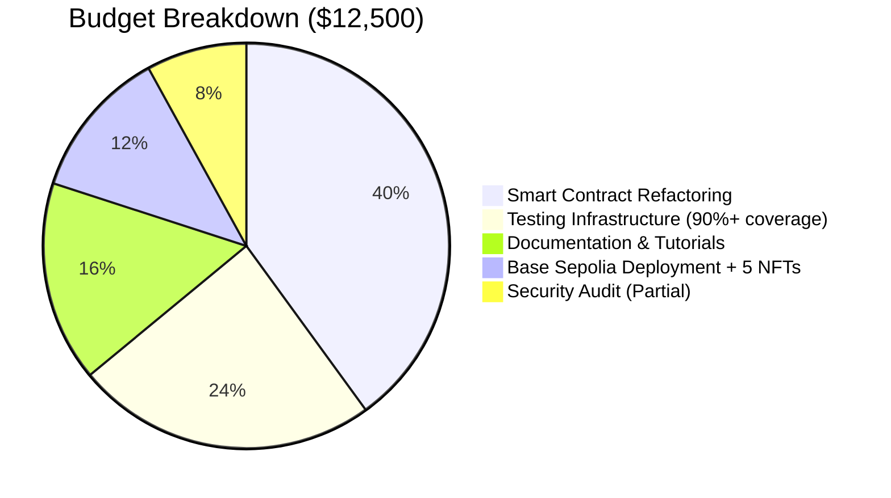
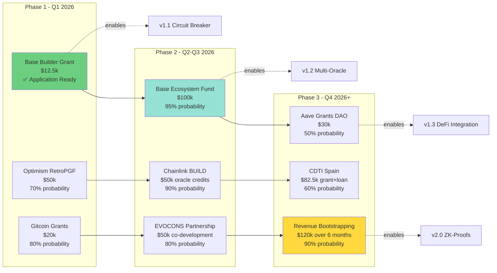
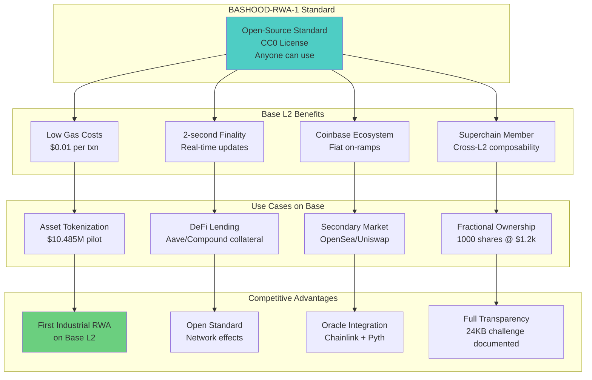
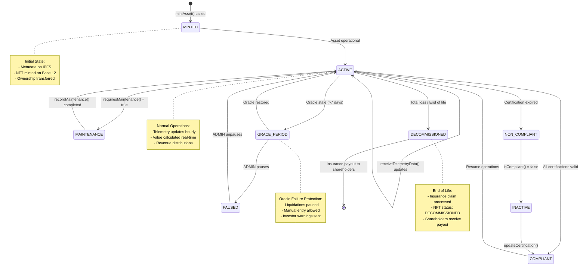

# BASHOOD-RWA-1 Architecture Diagram

**Purpose:** Visual representation of the industrial RWA tokenization system for Base Builder Grant application.

---

## High-Level Architecture



---

## Depreciation Models (6 Types)



---

## Tokenization Strategies (5 Types)



---

## Oracle Resilience Roadmap (v1.0 → v2.0)



---

## Contract Size Challenge & Solution



---

## Data Flow: Telemetry → Valuation → NFT Update



---

## Security Architecture (Multi-Layer Defense)

```mermaid
graph TB
    subgraph "Layer 1: Access Control"
        ADMIN[DEFAULT_ADMIN_ROLE<br/>Multi-sig 5-of-9]
        ASSET_MGR[ASSET_MANAGER_ROLE<br/>Mint assets, record maintenance]
        ORACLE_ROLE[ORACLE_ROLE<br/>Update telemetry]
        UPGRADER[UPGRADER_ROLE<br/>UUPS upgrades]
    end
    
    subgraph "Layer 2: Data Validation"
        BOUNDS[Bounds Checking<br/>Values cannot decrease]
        RATE[Rate Limiting<br/>Max 20% change per hour]
        ANOMALY[Anomaly Detection<br/>>3σ from mean]
    end
    
    subgraph "Layer 3: Oracle Resilience"
        STALE[Stale Data Detection<br/>>7 days]
        FALLBACK[Manual Entry Fallback<br/>ASSET_MANAGER can override]
        PAUSE[Emergency Pause<br/>ADMIN can halt]
    end
    
    subgraph "Layer 4: Upgrade Safety"
        TIMELOCK[48-hour Timelock<br/>On upgrades]
        GOVERNANCE[Multi-sig Approval<br/>Required for changes]
    end
    
    subgraph "Layer 5: Insurance"
        PHYSICAL[Physical Insurance<br/>AXA $1.2M coverage]
        SMART_CONTRACT[Smart Contract Insurance<br/>Nexus Mutual (planned)]
        CHAINLINK_BUILD[Chainlink BUILD<br/>Economic guarantees]
    end
    
    ADMIN --> BOUNDS
    ASSET_MGR --> BOUNDS
    ORACLE_ROLE --> BOUNDS
    
    BOUNDS --> RATE
    RATE --> ANOMALY
    
    ANOMALY --> STALE
    STALE --> FALLBACK
    FALLBACK --> PAUSE
    
    PAUSE --> TIMELOCK
    TIMELOCK --> GOVERNANCE
    
    GOVERNANCE --> PHYSICAL
    PHYSICAL --> SMART_CONTRACT
    SMART_CONTRACT --> CHAINLINK_BUILD
    
    style ADMIN fill:#4ecdc4
    style PAUSE fill:#ff6b6b
    style GOVERNANCE fill:#ffd93d
```

---

## Grant Funding Allocation



---

## Post-Grant Funding Strategy



---

## Integration with Base L2 Ecosystem



---

## Asset Lifecycle on Base L2



---

## Diagram Usage

**For Grant Application:**
1. Copy Mermaid code blocks into GitHub README.md (auto-renders)
2. Screenshot diagrams for PDF submissions
3. Use as visual aids in pitch presentations

**For Documentation:**
- High-Level Architecture: System overview
- Depreciation Models: How value calculation works
- Oracle Resilience: Security & reliability
- Contract Size Challenge: Transparency about current state

**For Investors:**
- Asset Lifecycle: How their NFT operates
- Data Flow: Where telemetry comes from
- Funding Strategy: Growth roadmap

---

**Rendering:** All diagrams use Mermaid.js syntax, which renders automatically on:
- GitHub (in .md files)
- GitLab
- Notion
- Obsidian
- VS Code (with Mermaid extension)

**Export Options:**
- PNG: Use Mermaid Live Editor (https://mermaid.live)
- SVG: For scalable graphics
- PDF: Print from browser after rendering

---

**Last Updated:** January 20, 2026  
**Version:** 1.0 (for Base Builder Grant)  
**License:** CC0 (Public Domain)
